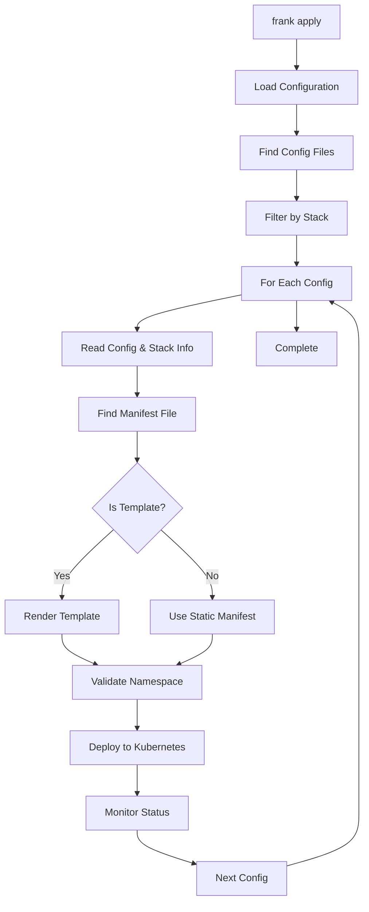
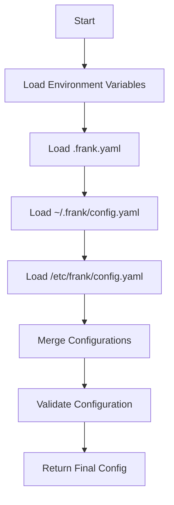
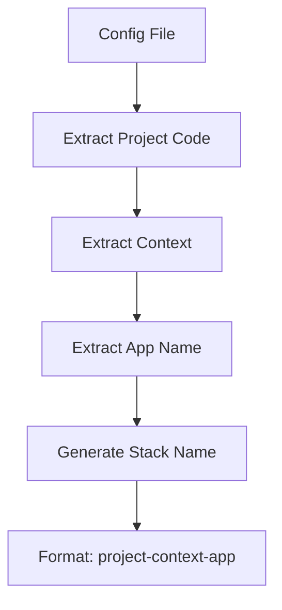

# Architecture

This document describes the internal architecture of Frank CLI, including its components, data flow, and design decisions.

## Overview

Frank CLI is built using Go and follows a modular architecture with clear separation of concerns. The application is organized into several packages, each responsible for specific functionality.

## Package Structure

```
frank-cli/
├── cmd/                    # Command-line interface
│   ├── root.go            # Root command and global flags
│   ├── apply.go           # Apply command implementation
│   ├── delete.go          # Delete command implementation
│   └── utils.go           # Shared utilities
├── pkg/
│   ├── config/            # Configuration management
│   │   └── config.go      # Viper-based configuration
│   ├── deploy/            # Deployment orchestration
│   │   ├── deployer.go    # Main deployment logic
│   │   └── deployer_test.go
│   ├── kubernetes/        # Kubernetes operations
│   │   ├── types.go       # Common types and structs
│   │   ├── deployer.go    # Resource deployment
│   │   ├── comparison.go  # Resource comparison logic
│   │   ├── delete.go      # Resource deletion
│   │   └── polling.go     # Status polling
│   ├── stack/             # Stack management
│   │   ├── stack.go       # Stack name generation and config inheritance
│   │   ├── stack_test.go
│   │   └── stack_error_test.go
│   └── template/          # Jinja templating
│       ├── renderer.go    # Template rendering engine
│       └── renderer_test.go
└── main.go                # Application entry point
```

## Core Components

### 1. Command Layer (`cmd/`)

The command layer provides the CLI interface using the Cobra framework:

- **`root.go`** - Defines the root command, global flags, and configuration loading
- **`apply.go`** - Implements the apply command with stack filtering and confirmation
- **`delete.go`** - Implements the delete command with stack filtering
- **`utils.go`** - Shared utilities like confirmation prompts

**Key Features**:
- Interactive confirmation prompts
- Stack-based filtering
- Configuration validation
- Error handling and user feedback

### 2. Configuration Management (`pkg/config/`)

Handles application configuration using Viper with a hierarchical precedence system:

**Configuration Sources** (in order of precedence):
1. Environment variables (`FRANK_LOG_LEVEL`)
2. `.frank.yaml` (current directory)
3. `$HOME/.frank/config.yaml` (user home)
4. `/etc/frank/config.yaml` (system-wide)

**Key Features**:
- Hierarchical configuration loading
- Environment variable support
- Default value handling
- Configuration validation

### 3. Stack Management (`pkg/stack/`)

Manages stack information, name generation, and configuration inheritance:

**Stack Name Generation**:
```
{project_code}-{context}-{app_name}
```

**Configuration Inheritance**:
- Child configurations override parent configurations
- Supports nested directory structures
- Handles missing values gracefully

**Key Features**:
- Stack name generation
- Configuration inheritance
- App name extraction from filenames
- Template context building

### 4. Template Engine (`pkg/template/`)

Provides Jinja templating capabilities for dynamic manifest generation:

**Supported Extensions**:
- `.jinja` - Standard Jinja templates
- `.j2` - Alternative Jinja extension

**Template Context Variables**:
- `stack_name` - Generated stack name
- `app_name` - App name from config or filename
- `version` - Version from config
- `project_code` - Project identifier
- `context` - Kubernetes context
- `namespace` - Target namespace

**Key Features**:
- Jinja template rendering
- Multi-document YAML support
- Rich template context
- Error handling and validation

### 5. Kubernetes Operations (`pkg/kubernetes/`)

Handles all Kubernetes API interactions:

#### `deployer.go` - Resource Deployment
- Creates and updates Kubernetes resources
- Handles resource comparison and updates
- Manages stack annotations and labels

#### `comparison.go` - Resource Comparison
- Compares existing and desired resources
- Handles default value normalization
- Determines if updates are needed

#### `delete.go` - Resource Deletion
- Finds and deletes frank-managed resources
- Supports stack-based filtering
- Handles multiple resource types

#### `polling.go` - Status Monitoring
- Polls resource status until ready
- Handles timeout and error conditions
- Provides status updates

**Key Features**:
- Intelligent resource updates
- Stack-based resource management
- Kubernetes best practice labels
- Comprehensive error handling

### 6. Deployment Orchestration (`pkg/deploy/`)

Coordinates the deployment process:

**Deployment Flow**:
1. **Configuration Discovery** - Find and load configuration files
2. **Stack Filtering** - Filter configurations based on stack argument
3. **Template Rendering** - Render Jinja templates with context
4. **Namespace Validation** - Check for namespace conflicts
5. **Resource Application** - Deploy resources to Kubernetes
6. **Status Monitoring** - Wait for resources to be ready

**Key Features**:
- Parallel deployment processing
- Stack-based filtering
- Template rendering integration
- Namespace conflict detection
- Comprehensive error handling

## Data Flow

### Apply Command Flow



### Configuration Loading Flow



### Stack Name Generation Flow



## Design Decisions

### 1. Modular Architecture

**Decision**: Split functionality into focused packages
**Rationale**: 
- Easier to test and maintain
- Clear separation of concerns
- Reusable components
- Better code organization

### 2. Configuration Inheritance

**Decision**: Use hierarchical configuration with inheritance
**Rationale**:
- Reduces configuration duplication
- Supports multi-environment setups
- Follows 12-factor app principles
- Flexible and extensible

### 3. Stack-Based Filtering

**Decision**: Use stack names for resource organization and filtering
**Rationale**:
- Provides clear resource ownership
- Enables selective deployments
- Supports complex multi-environment setups
- Easy to understand and use

### 4. Jinja Templating

**Decision**: Use Jinja for template rendering
**Rationale**:
- Powerful templating capabilities
- Familiar syntax for many developers
- Supports complex logic and filters
- Well-maintained Go implementation

### 5. Kubernetes Best Practices

**Decision**: Use standard Kubernetes labels and annotations
**Rationale**:
- Follows Kubernetes conventions
- Better integration with ecosystem tools
- Clear resource identification
- Future-proof design

### 6. Parallel Processing

**Decision**: Process multiple configurations concurrently
**Rationale**:
- Faster deployment times
- Better resource utilization
- Improved user experience
- Scalable architecture

## Error Handling

### Error Types

1. **Configuration Errors** - Invalid or missing configuration
2. **Template Errors** - Jinja template rendering failures
3. **Kubernetes Errors** - API communication or resource issues
4. **Validation Errors** - Namespace conflicts or invalid values

### Error Handling Strategy

1. **Fail Fast** - Validate configuration early
2. **Clear Messages** - Provide actionable error messages
3. **Debug Information** - Include context and suggestions
4. **Graceful Degradation** - Handle partial failures gracefully

## Testing Strategy

### Unit Tests

- **Package-level tests** - Test individual components
- **Mock external dependencies** - Kubernetes API, file system
- **Edge case coverage** - Error conditions and boundary cases
- **Template testing** - Validate template rendering

### Integration Tests

- **End-to-end workflows** - Complete deployment scenarios
- **Template workflows** - Jinja template processing
- **Error scenarios** - Failure handling and recovery

### Test Structure

```
pkg/
├── config/
│   └── config_test.go
├── deploy/
│   └── deployer_test.go
├── kubernetes/
│   └── comparison_test.go
├── stack/
│   ├── stack_test.go
│   └── stack_error_test.go
└── template/
    └── renderer_test.go
```

## Performance Considerations

### Memory Usage

- **Streaming processing** - Process configurations one at a time
- **Template caching** - Cache rendered templates when possible
- **Resource cleanup** - Clean up temporary files and resources

### CPU Usage

- **Parallel processing** - Use goroutines for concurrent operations
- **Efficient comparisons** - Optimize resource comparison logic
- **Template optimization** - Minimize template rendering overhead

### Network Usage

- **Batch operations** - Group Kubernetes API calls when possible
- **Connection pooling** - Reuse Kubernetes client connections
- **Timeout management** - Set appropriate timeouts for API calls

## Security Considerations

### Configuration Security

- **No secrets in config files** - Use environment variables for secrets
- **File permissions** - Secure configuration file permissions
- **Input validation** - Validate all configuration inputs

### Kubernetes Security

- **RBAC compliance** - Use appropriate service account permissions
- **Resource validation** - Validate Kubernetes resource specifications
- **Namespace isolation** - Respect namespace boundaries

## Future Enhancements

### Planned Features

1. **Dry-run mode** - Preview changes without applying
2. **Resource diffing** - Show detailed changes before applying
3. **Rollback support** - Rollback to previous versions
4. **Metrics collection** - Deployment metrics and monitoring
5. **Plugin system** - Extensible plugin architecture

### Architecture Improvements

1. **Event system** - Publish deployment events
2. **Caching layer** - Cache frequently accessed data
3. **Configuration validation** - Schema-based validation
4. **Health checks** - Application health monitoring
5. **Observability** - Structured logging and tracing
